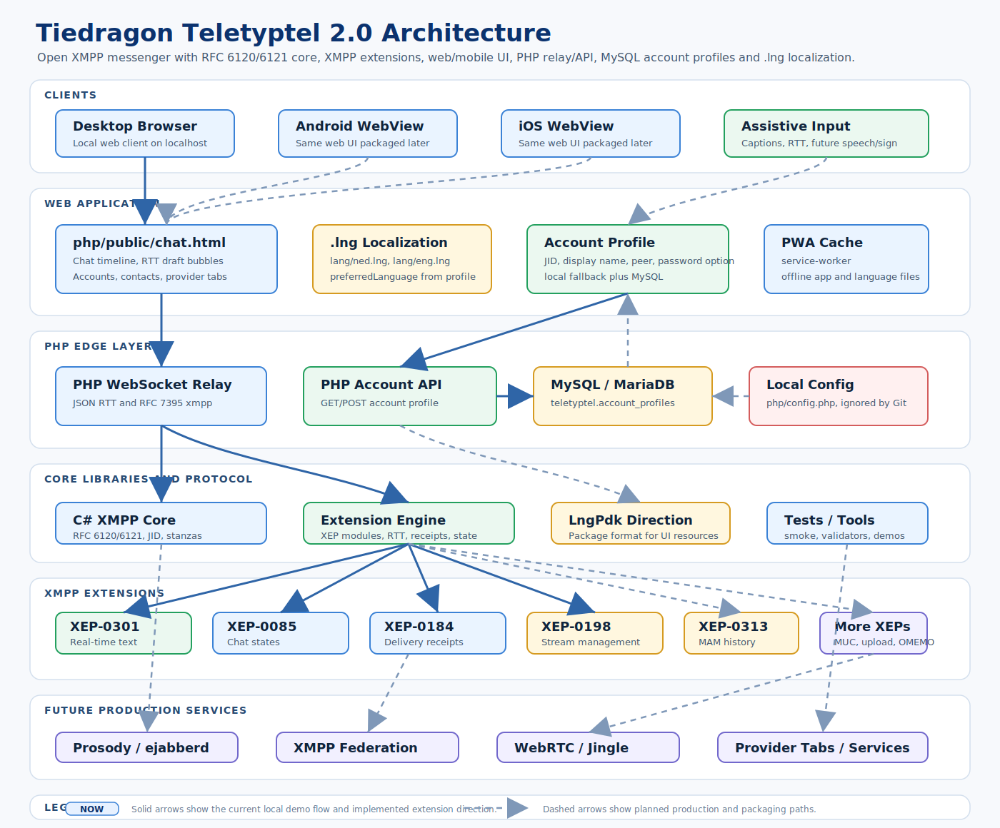

# Tiedragon Teletyptel 2.0

Tiedragon Teletyptel 2.0 is an alpha XMPP messenger project focused on
accessible real-time text and Total Conversation: live text, audio and video in
one conversation flow. The current Alpha 2 codebase is usable as an evaluation
build: it includes a web chat UI, PHP WebSocket edge relay, C# XMPP core, local
STARTTLS XMPP server, real-server smoke tool and repeatable test suite.

This is not a production messenger yet. It is a developer/tester release for
evaluating the protocol stack, live typing model and web/mobile UI direction
before the public hosted service is opened.

## Scope

Current scope:

- alpha evaluation build for developers and testers;
- accessible RTT-first messenger UI experiments for browser and Windows;
- C# XMPP client core with repeatable protocol tests;
- local PHP relay for browser/WebRTC experiments;
- local STARTTLS XMPP development server for compliance smoke testing;
- public-server smoke tooling for real XMPP accounts.

Out of scope for the current alpha:

- internet-facing production XMPP hosting by `LocalServer`;
- production account security, abuse handling, rate limits and moderation;
- production OMEMO interoperability until an audited Signal Protocol backend is
  wired in;
- a public hosted Teletyptel service;
- compliance-directory claims before the release validation checklist is fully
  completed.

`Tiedragon.XmppMessenger.LocalServer` is a real local C2S protocol test server,
not a fake relay, but it is intentionally scoped to localhost/protected lab
testing. For production deployment the server direction remains Prosody or
ejabberd plus coturn, HTTP upload, MAM and PubSub/PEP modules.

The XMPP client core is built in this repository rather than delegated to a
third-party XMPP library. Teletyptel 2.0 should own its RFC 6120 stream flow,
TLS/SASL negotiation, stanza models and XEP-0301 real-time text behavior while
still using normal platform primitives such as TLS, XML and WebSocket APIs.

## Evaluate Today

- Start here: [Getting Started](docs/GETTING_STARTED.md)
- User-facing guide: [User Guide](docs/USER_GUIDE.md)
- XEP-0479 roadmap: [Roadmap](docs/ROADMAP.md)
- Implementation checklist: [Implementation Checklist](docs/IMPLEMENTATION_CHECKLIST.md)
- Alpha 1 release notes: [Release Notes](docs/RELEASE_NOTES_ALPHA1.md)
- Changelog: [CHANGELOG.md](CHANGELOG.md)
- Real server and local server setup: [Real Server Setup](docs/REAL_SERVER_SETUP.md)
- Windows deployment/setup: [Windows Setup](docs/WINDOWS_SETUP.md)
- Linux deployment/setup: [Linux Setup](docs/LINUX_SETUP.md)
- OMEMO interop smoke: [OMEMO Interop Smoke](docs/OMEMO_INTEROP_SMOKE.md)
- Jingle interop smoke: [Jingle Interop Smoke](docs/JINGLE_INTEROP_SMOKE.md)
- NG112 and location direction: [NG112 Teletyptel Notes](docs/NG112_TELETYPTEL_NOTES.md)
- Historical 2005 report notes: [TeleTypTel 2005 Report Notes](docs/TELETYPTEL_2005_REPORT_NOTES.md)
- AnnieS market and continuity lessons: [AnnieS Case Notes](docs/ANNIES_CASE_NOTES.md)
- XSF readiness checklist: [XSF Software Directory Preparation](docs/XSF_SOFTWARE_DIRECTORY.md)

## Architecture



Localization note: the current web `.lng` files are a development/fallback
layer. They are not the same trust boundary as signed LngPdk packages. See
[Localization Critical Notes](docs/LOCALIZATION_CRITICAL_NOTES.md).

Alpha 2 currently provides:

- browser chat UI with light/dark mode, contact/group list, account gate,
  server-side account profile storage and WebRTC call controls
- Total Conversation web smoke: a Jingle/WebRTC audio/video call can carry
  synchronized RTT over a reliable `rtt` datachannel using the current
  ProtoXEP `urn:xmpp:jingle:apps:rtt-sync:0`, with XEP-0301 fallback when the
  call channel is unavailable
- local PHP WebSocket edge relay for live RTT, RFC 7395 frame and browser
  Jingle/WebRTC experiments
- local web file upload with chat attachment cards
- local account profile storage with MySQL API fallback
- English and Dutch web UI language files
- legacy smiley rendering with SVG/GIF assets
- C# XMPP core for JIDs, stream negotiation, TLS/SASL, bind, roster,
  presence, chat, service discovery, stream management, client state
  indication, registration, receipts, carbons, archive query models,
  XEP-0308 message correction and XEP-0301 RTT
- protocol helpers for MUC room discovery/config/admin, room bookmarks,
  MUC self-ping, HTTP file upload slots,
  SOCKS5 bytestream negotiation with local streamhost handshake/data smoke and
  hosted proxy smoke, IBB fallback byte-transfer smoke, Jingle file-transfer
  metadata/S5B/IBB transports, OMEMO wire stanzas, OMEMO payload/trust
  boundary helpers and Jingle RTP/ICE/DTLS signaling, including
  existing-client fixture smokes
- local XMPP server with mandatory STARTTLS, SASL PLAIN, bind, session,
  roster, presence, chat, vCard, blocking, stream management, client state
  indication, STUN/TURN discovery, MUC and XEP-0363 slot/PUT smoke paths
- real-server smoke tool for TLS, hostname validation, XEP-0077 and
  two-account chat plus XEP-0045 MUC, XEP-0363 upload, XEP-0215 STUN/TURN,
  XEP-0065 SOCKS5 bytestream proxy, XEP-0047 IBB fallback, XEP-0313
  one-to-one MAM, XEP-0308 correction, BOSH and direct TLS smoke paths

The longer-term project goal is a modern messenger with:

- one-to-one chat
- contact list / roster
- presence status
- message history
- delivery receipts
- real-time text
- total conversation with synchronized live text, audio and video
- group chat
- file and image sharing
- browser-to-browser audio calling over WebRTC
- browser-to-browser video calling over WebRTC

## Protocol Direction

Core protocols:

- RFC 6120 - XMPP Core
- RFC 6121 - Instant Messaging and Presence
- RFC 7622 - XMPP Address Format
- RFC 7590 - TLS for XMPP

Important XMPP extensions:

- XEP-0030 - Service Discovery
- XEP-0047 - In-Band Bytestreams
- XEP-0045 - Multi-User Chat
- XEP-0048 - Bookmarks
- XEP-0049 - Private XML Storage
- XEP-0065 - SOCKS5 Bytestreams
- XEP-0077 - In-Band Registration
- XEP-0080 - User Location
- XEP-0085 - Chat State Notifications
- XEP-0184 - Message Delivery Receipts
- XEP-0198 - Stream Management
- XEP-0223 - Persistent Storage of Private Data via PubSub
- XEP-0280 - Message Carbons
- XEP-0301 - In-Band Real Time Text
- XEP-0308 - Last Message Correction
- XEP-0313 - Message Archive Management
- XEP-0363 - HTTP File Upload
- XEP-0384 - OMEMO Encryption
- XEP-0402 - PEP Native Bookmarks
- XEP-0410 - MUC Self-Ping
- XEP-0166 - Jingle
- XEP-0167 - Jingle RTP Sessions
- XEP-0176 - Jingle ICE-UDP Transport
- XEP-0234 - Jingle File Transfer
- XEP-0260 - Jingle SOCKS5 Bytestreams Transport Method
- XEP-0261 - Jingle In-Band Bytestreams Transport Method
- XEP-0320 - Use of DTLS-SRTP in Jingle Sessions
- XEP-0353 - Jingle Message Initiation

Audio and video use XMPP/Jingle call setup and WebRTC media transport. The web
demo can place local relay calls today. The core builds and parses XEP-0353
call proposal messages (`propose`, `ringing`, `proceed`, `reject`, `retract`
and `finish`) with XEP-0167 audio/video RTP descriptions. It also parses an
existing-client Jingle fixture covering audio/video RTP, ICE trickle, DTLS and
session-info events. A live federated call with Dino, Gajim, Conversations or
Monal still needs server-backed IQ routing and real test accounts.

Location is part of the accessibility and emergency-readiness direction, not a
casual tracking feature. Teletyptel should use XEP-0080 for XMPP user location
and keep a separate NG112 gateway model for PIDF-LO/RFC 6442 style emergency
location exchange. The protocol layer now has XEP-0080 parse/serialize,
server capability detection and PEP publish/retrieve/clear helpers. Some XMPP
servers do not support PEP/XEP-0080, so clients must discover support and
degrade cleanly. The web client has explicit browser permission, share-once,
live-share, stop-share, stale/accuracy/server-support warnings and PIDF-LO
export for simulator/gateway experiments; real-server non-emergency PEP smoke
on supporting and non-supporting servers remains release-validation work.

## Server Direction

Candidate server stack:

- Prosody or ejabberd for XMPP
- coturn for STUN/TURN
- HTTP upload module for files
- MAM support for history
- PubSub/PEP support for OMEMO

## Release Lines

Release lines now follow XEP-0479 gates instead of loose feature buckets:

- Phase 1: Core Client.
- Phase 2: Web Client.
- Phase 3: IM Client.
- Phase 4: Mobile Client.
- Phase 5: A/V Calling Client.

RTT, accessibility, location and LngPdk remain Teletyptel product additions,
but they do not replace the official XEP-0479 requirements.

Calling now has a local browser audio/video demo, device selection, per-call
device switching and an existing-client Jingle wire-shape smoke. The next
hardening step is a live federated call against an installed Jingle client.

## Current Code

Local development XMPP server:

```powershell
dotnet run --project tools/Tiedragon.XmppMessenger.LocalServer -- `
  --listen 127.0.0.1 `
  --port 55222 `
  --domain localhost `
  --account edward:secret `
  --account anna:secret
```

The local server requires STARTTLS and supports XEP-0077, SASL PLAIN,
resource binding, session IQ, roster get/set/remove, presence, direct
one-to-one chat relay, vCard, blocking, stream management, client state
indication, STUN/TURN discovery, upload slots and a small MUC conference path.
For local self-signed certificates, pass the printed SHA-256 fingerprint to the
smoke tool with `--cert-sha256`.

One-command local server compliance smoke:

```powershell
.\scripts\local-xmpp-server-smoke.ps1
```

This starts `LocalServer`, captures its certificate fingerprint and verifies it
through the same `RealServerSmoke` client stack used for public XMPP servers.

```text
src/Tiedragon.XmppMessenger.Core
tests/Tiedragon.XmppMessenger.Tests
samples/Tiedragon.XmppMessenger.WebSocketConsole
samples/Tiedragon.XmppMessenger.WinFormsDemo
samples/Tiedragon.XmppMessenger.AiBotConsole
php/rtt-websocket-server.php
php/public/index.html
```

The first implemented layer is `Tiedragon.XmppMessenger.Core.Rtt`:

- parse and serialize XEP-0301 `<rtt/>` XML
- model `new`, `reset`, `edit`, `init` and `cancel`
- apply insert, erase and wait actions to a live text buffer
- validate `seq` ordering and ignore out-of-sync edits until reset
- count positions as Unicode code points, not UTF-16 units
- wrap RTT XML or normal message snapshots in the demo JSON envelope used by
  PHP/WebSocket experiments

The first XMPP model layer is `Tiedragon.XmppMessenger.Core.Xmpp`:

- parse and normalize XMPP addresses/JIDs
- keep account, host, port and TLS requirements in connection settings
- keep stream defaults such as resource, language, timeout and keep-alive
- model feature flags such as roster, presence, stream management and RTT
- serialize first RFC 6120/6121 stanzas: chat messages, presence and roster IQ
- parse first incoming RFC 6120/6121 stanzas back into typed models
- create and parse first higher-level XEP stanzas for MUC room discovery,
  configuration/admin/bookmark/self-ping flows, HTTP upload, OMEMO
  device/encrypted wrappers and Jingle session signaling

The higher-level XEP helpers are protocol foundations with repeatable tests.
OMEMO now has the current wire model, bundle parser/publisher, payload
encryption/decryption boundary helper, trust/fingerprint model, Signal Protocol
backend boundary, X3DH key-plan/KDF helper, X25519 initiator/responder
agreement, a signed pre-key verification gate, an opaque Double Ratchet session
store contract, local device key material/publication helpers and an encrypted
local device key file. Production OMEMO still needs an audited verifier/backend,
real Double Ratchet engine and live Linux/macOS vault smoke; Windows DPAPI,
Linux Secret Service and macOS Keychain providers are in place. Audio/video now
has Jingle RTP/ICE/DTLS signaling models, an existing-client stanza fixture
smoke and a browser WebRTC relay bridge; live federated call testing remains the
release-validation step.

The localization layer is the independent `Tiedragon.LngPdk` library:

- load simple `.lng` key-value files
- compile and load LngPdk `.lngpdk` language packages with
  `Tiedragon.LngPdk.Tool`
- keep the XMPP core independent from package storage and UI translation logic
- use fallback keys when a translation is missing
- keep WinForms demo labels, buttons, placeholders and status text out of code

The web client also has loose `.lng` files under `php/public/lang` for fast
iteration. Those files should not be treated as verified production packages.

## Build

```bash
dotnet build Tiedragon.XmppMessenger.slnx
```

## Test

```bash
dotnet run --project tests/Tiedragon.XmppMessenger.Tests/Tiedragon.XmppMessenger.Tests.csproj
```

Expected result:

```text
All RTT tests passed.
```

## Web Chat Demo

The repository also contains a small PHP WebSocket relay for browser RTT
experiments. This is not the final XMPP server layer; it is a local test bridge.

```bash
php php/rtt-websocket-server.php
```

Then open `php/public/chat.html` in two browser windows and connect both to:

```text
ws://127.0.0.1:8787
```

For two real browser-side test accounts, open two profiles:

```text
http://127.0.0.1:8090/chat.html?profile=edward
http://127.0.0.1:8090/chat.html?profile=tester
```

Each profile stores its own local account settings, JID and generated browser
resource. The second session can also be opened from the Connection panel.

PHP is not bundled with this repository. `php/public/index.html` remains a
minimal RTT protocol page; `php/public/chat.html` is the preferred Alpha UI.

## C# WebSocket Console Demo

After starting the PHP relay, run:

```bash
dotnet run --project samples/Tiedragon.XmppMessenger.WebSocketConsole/Tiedragon.XmppMessenger.WebSocketConsole.csproj
```

Optional custom WebSocket URL:

```bash
dotnet run --project samples/Tiedragon.XmppMessenger.WebSocketConsole/Tiedragon.XmppMessenger.WebSocketConsole.csproj -- ws://127.0.0.1:8787
```

Send once and exit:

```bash
dotnet run --project samples/Tiedragon.XmppMessenger.WebSocketConsole/Tiedragon.XmppMessenger.WebSocketConsole.csproj -- --send "Hello RTT"
```

This console client uses the same `RttPacket`, `RttComposer`,
`RttMessageState` and JSON envelope as the browser demo.

## WinForms RTT Demo

After starting the PHP relay, run:

```bash
dotnet run --project samples/Tiedragon.XmppMessenger.WinFormsDemo/Tiedragon.XmppMessenger.WinFormsDemo.csproj
```

In the WAMP release zip, this app is published under
`wamp\bin\teletyptel\WindowsApp`.

Open two instances to test live RTT text between windows.

The Windows app can also talk to the browser relay demo. Keep `Peer` as
`relay@localhost` for the shared room, or enter the other side's bare/full JID
for a directed test.

The `RTT live` checkbox controls the first compatibility mode:

- enabled: every edit is sent as RTT delta text
- disabled: no live typing is sent; the current message snapshot is sent after
  Enter

This mirrors the later XMPP direction: contacts or clients can support RTT, or
fall back to ordinary message bodies.

## AI Bot Console Demo

After starting the PHP relay and one WinForms demo, run:

```bash
dotnet run --project samples/Tiedragon.XmppMessenger.AiBotConsole/Tiedragon.XmppMessenger.AiBotConsole.csproj
```

The bot listens to live RTT text, but it does not join the conversation by
itself. It only replies to completed lines that start with `ai:` or `@ai`, for
example `ai: hallo`. Bot answers also end with Enter so the next message starts
on a new line. This first bot is local/rule-based; it proves the participant
model before connecting a real AI service.

Options:

```bash
dotnet run --project samples/Tiedragon.XmppMessenger.AiBotConsole/Tiedragon.XmppMessenger.AiBotConsole.csproj -- --quiet 1200 --typing-delay 35
```

## License

MIT. See [LICENSE](LICENSE).
