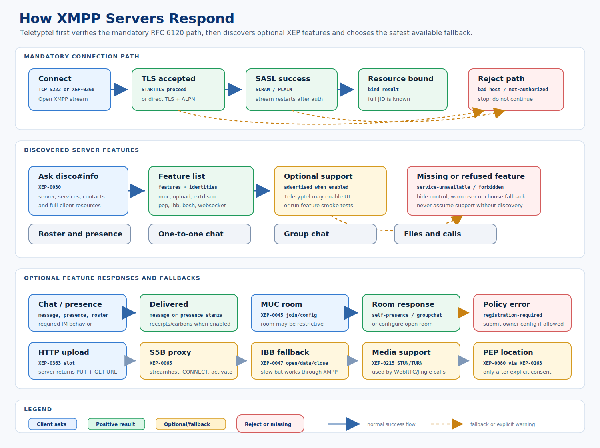

# Real Server Setup Guide

This guide describes the manual smoke environment for testing the library
against a real XMPP server. Automated real-server tests remain unchecked until
credentials and a local server profile are available.



## Local Prosody Direction

Recommended local domain:

```text
localhost
```

Recommended accounts:

```text
edward@localhost
anna@localhost
```

Minimum modules:

```text
roster
tls
saslauth
disco
carbons
mam
smacks
websocket
bosh
muc
```

Useful optional modules:

```text
vcard
pep
cloud_notify
```

## Manual Smoke Checklist

- TLS certificate is accepted only when the configured host matches.
- Login negotiates STARTTLS, SASL and resource binding.
- XEP-0368 direct TLS discovers `_xmpps-client._tcp` or connects with
  `--direct-tls`, validates the JID domain and requests ALPN `xmpp-client`.
- Initial presence is sent.
- Roster request returns.
- Two accounts can exchange normal chat messages.
- Two accounts can discover a MUC service, join a room and exchange a
  groupchat message.
- An XEP-0363 upload service advertises `urn:xmpp:http:upload:0`, returns a
  slot, accepts HTTP PUT and exposes the GET URL.
- An XEP-0065 bytestream proxy is discovered through service discovery or
  supplied explicitly, accepts both SOCKS5 CONNECT requests, activates the
  stream and relays bytes.
- XEP-0047 IBB fallback accepts `open`, ordered IQ `data` chunks and `close`
  between two logged-in accounts.
- XEP-0313 MAM advertises `urn:xmpp:mam:2`, archives a seeded one-to-one
  message and returns it through a server archive query.
- An XEP-0215 external service endpoint advertises
  `urn:xmpp:extdisco:2`, returns STUN/TURN services and returns temporary
  credentials for restricted TURN services.
- XEP-0301 RTT message payload is sent with body fallback.
- XEP-0030 disco#info returns feature list.
- XEP-0115 capabilities presence is accepted.
- RFC 7395 WebSocket transport connects when the server exposes WebSocket.
- XEP-0124/XEP-0206 BOSH login, stream restart, binding, disco and optional
  two-account chat work when the server exposes an HTTP binding endpoint.

## Automated Smoke Tool

Use the real-server smoke tool when a Prosody/Openfire profile and two accounts
are available:

`Tiedragon.XmppMessenger.RealServerSmoke` is intentionally built on top of the
same `Tiedragon.XmppMessenger.Core` library that applications use. A passing
smoke therefore validates the library behavior, not only the command-line tool.

TLS and hostname-only smoke:

```powershell
dotnet run --project tools/Tiedragon.XmppMessenger.RealServerSmoke -- `
  --host xmpp.example.org `
  --port 5222 `
  --account1 edward@example.org/desktop `
  --password1 secret `
  --bad-host wrong.example.org
```

Direct TLS smoke through XEP-0368 SRV discovery:

```powershell
dotnet run --project tools/Tiedragon.XmppMessenger.RealServerSmoke -- `
  --discover-direct-tls `
  --account1 edward@example.org/desktop `
  --password1 secret `
  --bad-host wrong.example.org
```

Accountless public internet TLS probe:

```powershell
dotnet run --project tools/Tiedragon.XmppMessenger.RealServerSmoke -- `
  --discover-direct-tls `
  --tls-only `
  --account1 smoke@example.org/teletyptel `
  --password1 dummy `
  --bad-host wrong.example.org `
  --timeout-seconds 20
```

`--tls-only` is meant for public internet probing before credentials exist. It
checks SRV/XEP-0368 discovery, STARTTLS or direct TLS and hostname validation,
then stops before SASL login, roster, message, MUC, upload or blocking tests.
Use it for public servers where creating throwaway accounts would be rude or
not allowed.

Direct TLS smoke against a known host and port:

```powershell
dotnet run --project tools/Tiedragon.XmppMessenger.RealServerSmoke -- `
  --host xmpps.example.org `
  --port 5223 `
  --direct-tls `
  --account1 edward@example.org/desktop `
  --password1 secret
```

BOSH-only smoke against a known HTTP binding endpoint:

```powershell
dotnet run --project tools/Tiedragon.XmppMessenger.RealServerSmoke -- `
  --bosh-only `
  --bosh-url https://xmpp.example.org/http-bind `
  --account1 edward@example.org/bosh `
  --password1 secret `
  --account2 anna@example.org/bosh `
  --password2 secret
```

BOSH smoke through XEP-0156 `xbosh` discovery:

```powershell
dotnet run --project tools/Tiedragon.XmppMessenger.RealServerSmoke -- `
  --bosh-only `
  --discover-bosh `
  --account1 edward@example.org/bosh `
  --password1 secret
```

BOSH endpoint discovery without login:

```powershell
dotnet run --project tools/Tiedragon.XmppMessenger.RealServerSmoke -- `
  --discover-bosh `
  --bosh-discovery-only `
  --account1 smoke@example.org/teletyptel `
  --password1 dummy `
  --timeout-seconds 20
```

`--bosh-discovery-only` checks XEP-0156 host-meta for `xbosh` and prints the
endpoint without attempting SASL. Run the full BOSH smoke only after real test
accounts are available.

Provider candidate probe:

```powershell
scripts\probe-public-xmpp-providers.ps1 -IncludeBoshDiscovery
```

The provider probe runs the accountless TLS-only smoke for a short list of
public domains, optionally checks BOSH discovery and writes a markdown report
under `artifacts\public-server-probes`. Pass `-Domains` or `-DomainsFile` to
test another provider list. Use this before creating accounts so the selected
server already has a reachable TLS path.

Registration form probe:

```powershell
dotnet run --project tools/Tiedragon.XmppMessenger.RealServerSmoke -- `
  --discover-direct-tls `
  --registration-info `
  --account1 teletyptel-probe@conversations.im/teletyptel `
  --password1 dummy `
  --bad-host wrong.example.org
```

`--registration-info` asks for the XEP-0077 form and stops before creating an
account. Use it on public servers before `--register`, especially when the
server requires `jabber:x:data` and CAPTCHA.

Interactive account creation with CAPTCHA:

```powershell
dotnet run --project tools/Tiedragon.XmppMessenger.AccountRegistration --configuration Release
```

The registration app keeps the XMPP stream open while it downloads the CAPTCHA
image and submits the answer. That avoids the expired-CAPTCHA problem that can
happen when the image is copied into a separate script or browser flow. Create
two accounts on the same selected public server, then run the two-account smoke
with the resulting credentials.

Full TLS, hostname and two-account chat smoke:

```powershell
dotnet run --project tools/Tiedragon.XmppMessenger.RealServerSmoke -- `
  --host xmpp.example.org `
  --port 5222 `
  --account1 edward@example.org/desktop `
  --password1 secret `
  --account2 anna@example.org/desktop `
  --password2 secret `
  --bad-host wrong.example.org
```

The tool performs three checks:

- accepts the TLS certificate for the configured host;
- rejects the same endpoint when the certificate is validated with
  `--bad-host`;
- logs in, binds a resource and requests the roster;
- logs in with two accounts and waits for a normal chat message to arrive when
  `--account2` and `--password2` are supplied.

## Public Server Two-Account Recipe

For the real public-server milestone, use two normal test accounts on the same
public XMPP server. Keep passwords in environment variables, not in command
history or documentation.

Minimum account setup:

```powershell
$env:TELETYPTEL_XMPP_ACCOUNT1 = "edward@example.org/teletyptel-a"
$env:TELETYPTEL_XMPP_PASSWORD1 = "<password for account1>"
$env:TELETYPTEL_XMPP_ACCOUNT2 = "tester@example.org/teletyptel-b"
$env:TELETYPTEL_XMPP_PASSWORD2 = "<password for account2>"
```

Optional feature endpoints:

```powershell
$env:TELETYPTEL_XMPP_MUC_SERVICE = "conference.example.org"
$env:TELETYPTEL_XMPP_MUC_ROOM = "teletyptel-smoke@conference.example.org"
$env:TELETYPTEL_XMPP_UPLOAD_FILE = "C:\Users\Edward Tie\AppData\Local\Temp\teletyptel-upload-smoke.txt"
$env:TELETYPTEL_XMPP_EXTERNAL_SERVICE_TYPE = "turn"
$env:TELETYPTEL_XMPP_SOCKS5_SMOKE = "1"
$env:TELETYPTEL_XMPP_IBB_SMOKE = "1"
$env:TELETYPTEL_XMPP_MAM_SMOKE = "1"
```

Create the upload smoke file when upload testing is enabled:

```powershell
Set-Content -LiteralPath $env:TELETYPTEL_XMPP_UPLOAD_FILE -Value "Teletyptel upload smoke"
```

Then run:

```powershell
scripts\real-public-server-smoke.ps1 -DiscoverDirectTls -DiscoverBosh
```

For direct file-transfer validation, enable the extra bytestream checks:

```powershell
scripts\real-public-server-smoke.ps1 -DiscoverDirectTls -DiscoverBosh -Socks5Smoke -IbbSmoke
```

For message archive validation, enable the XEP-0313 check:

```powershell
scripts\real-public-server-smoke.ps1 -DiscoverDirectTls -MamSmoke
```

The runner calls `Tiedragon.XmppMessenger.RealServerSmoke` and covers:

- TLS and hostname rejection;
- login, resource binding and roster retrieval;
- XEP-0157 server contact discovery when advertised;
- two-account one-to-one chat;
- XEP-0045 MUC discovery, room join and groupchat when `TELETYPTEL_XMPP_MUC_SERVICE`
  and `TELETYPTEL_XMPP_MUC_ROOM` are set;
- XEP-0363 upload discovery, slot request, HTTP PUT and attachment message when
  `TELETYPTEL_XMPP_UPLOAD_FILE` is set;
- XEP-0065 hosted SOCKS5 bytestream proxy discovery, proxy activation and byte
  transfer when `TELETYPTEL_XMPP_SOCKS5_SMOKE=1` or
  `TELETYPTEL_XMPP_SOCKS5_PROXY` is set;
- XEP-0047 IBB fallback open/data/close byte transfer when
  `TELETYPTEL_XMPP_IBB_SMOKE=1`;
- XEP-0313 one-to-one MAM advertisement, archive query and seeded message
  lookup when `TELETYPTEL_XMPP_MAM_SMOKE=1`;
- XEP-0215 STUN/TURN discovery when `TELETYPTEL_XMPP_EXTERNAL_SERVICE` or
  `TELETYPTEL_XMPP_EXTERNAL_SERVICE_TYPE` is set;
- XEP-0124/XEP-0206 BOSH login/disco/chat when `-DiscoverBosh` or
  `TELETYPTEL_XMPP_BOSH_URL` is used.

Jingle/WebRTC calls are validated after this smoke passes by opening the web
client with both real accounts and placing an audio or video call. The command
line smoke checks the server/account foundation first; browser media permission,
ICE and call UI are tested in the web client.

## Public Server Validation Checklist

Use this as the release evidence checklist for a real public XMPP server.
Current evidence already recorded in this repository:

- [x] README and XSF notes state that public server validation is release
  evidence, not a production-hosting claim.
- [x] Direct TLS and hostname-negative internet probes have passed for public
  XMPP domains.
- [x] A two-account public-server chat smoke has passed.
- [x] XEP-0156 BOSH endpoint discovery has been verified on a public domain.
- [x] `conversations.im` public two-account validation passed on 2026-05-29:
  XEP-0368 direct TLS, hostname-negative TLS, login/bind, roster, XEP-0157,
  one-to-one chat, XEP-0363 upload, XEP-0045 MUC, BOSH and XEP-0215 STUN
  discovery.
- [x] `conversations.im` direct file-transfer validation passed on 2026-05-30:
  XEP-0065 hosted SOCKS5 bytestream proxy discovery, target and initiator
  SOCKS5 CONNECT, proxy activation, byte transfer and XEP-0047 IBB
  open/data/close fallback byte transfer.
- [x] `conversations.im` one-to-one message archive validation passed on
  2026-05-30: XEP-0313 advertised `urn:xmpp:mam:2`, a seeded chat message
  was delivered, and the same message was returned by MAM with an archive id
  and server timestamp.
- [ ] The final production Teletyptel server domain is selected and documented.

Final release evidence still needs the chosen hosted evaluation or production
server to complete the unchecked items below:

- [ ] Pick one public server and create two normal test accounts on the same
  domain.
- [ ] Confirm the server permits this kind of testing and does not prohibit
  automated smoke traffic.
- [ ] Run `scripts\probe-public-xmpp-providers.ps1 -IncludeBoshDiscovery` and
  select one reachable candidate.
- [ ] Run `--registration-info` and note whether registration is simple,
  data-form based or CAPTCHA protected.
- [ ] If CAPTCHA is required, create the accounts with
  `tools\Tiedragon.XmppMessenger.AccountRegistration` so the CAPTCHA and submit
  happen on the same live XMPP stream.
- [ ] Set `TELETYPTEL_XMPP_ACCOUNT1`, `TELETYPTEL_XMPP_PASSWORD1`,
  `TELETYPTEL_XMPP_ACCOUNT2` and `TELETYPTEL_XMPP_PASSWORD2`.
- [ ] Run a TLS-only probe with `--discover-direct-tls --tls-only`.
- [ ] Confirm the certificate passes for the real host and fails with
  `--bad-host`.
- [ ] Run `scripts\real-public-server-smoke.ps1 -DiscoverDirectTls`.
- [ ] Confirm login, resource binding and roster retrieval for account 1.
- [ ] Confirm account 1 can send a normal one-to-one chat message to account 2.
- [ ] Confirm XEP-0157 service contact addresses are printed when the server
  advertises them.
- [ ] Set `TELETYPTEL_XMPP_MUC_SERVICE` and
  `TELETYPTEL_XMPP_MUC_ROOM`, then confirm MUC discovery, join and groupchat.
- [ ] Set `TELETYPTEL_XMPP_UPLOAD_FILE`, then confirm XEP-0363 upload
  discovery, max-file-size, slot request, HTTP PUT and attachment message.
- [x] Set `TELETYPTEL_XMPP_SOCKS5_SMOKE=1`, then confirm XEP-0065 bytestream
  proxy discovery, target/initiator SOCKS5 CONNECT, proxy activation and byte
  transfer. Set `TELETYPTEL_XMPP_SOCKS5_PROXY` when discovery does not find
  the proxy component.
- [x] Set `TELETYPTEL_XMPP_IBB_SMOKE=1`, then confirm XEP-0047 IBB
  `disco#info`, `open`, ordered `data`, `close` and byte verification.
- [x] Set `TELETYPTEL_XMPP_MAM_SMOKE=1`, then confirm XEP-0313 one-to-one
  archive discovery, seed message delivery and MAM lookup.
- [ ] Set `TELETYPTEL_XMPP_MUC_MAM_SMOKE=1` with a known archive-enabled
  MUC room, then confirm room archive lookup.
- [ ] Run with `-DiscoverBosh` or `TELETYPTEL_XMPP_BOSH_URL` when the server
  advertises BOSH.
- [ ] Run XEP-0215 external service discovery when STUN/TURN is advertised.
- [ ] Open the web client twice with the two real accounts and confirm RTT,
  normal chat and presence/online state.
- [ ] Place an audio/video call between the two browser sessions; verify
  incoming-call prompt, answer, hangup, mute, volume and camera on/off.
- [ ] Repeat one call against an existing Jingle-capable client when available.
- [ ] Save the server domain, date, supported features and smoke output in the
  release notes.

For public servers, use accounts created for testing and avoid repeatedly
creating throwaway accounts. Use `--register` only on servers where automated
in-band registration is explicitly allowed.

Verified public two-account feature smoke on 2026-05-29:

```powershell
scripts\real-public-server-smoke.ps1 -NoBuild -DiscoverBosh
```

Environment summary, with secrets omitted:

```powershell
$env:TELETYPTEL_XMPP_ACCOUNT1 = "teletyptel-1@conversations.im/full-a-<timestamp>"
$env:TELETYPTEL_XMPP_ACCOUNT2 = "teletyptel-12@conversations.im/full-b-<timestamp>"
$env:TELETYPTEL_XMPP_HOST = "xmpps.conversations.im"
$env:TELETYPTEL_XMPP_PORT = "443"
$env:TELETYPTEL_XMPP_DIRECT_TLS = "1"
$env:TELETYPTEL_XMPP_MUC_SERVICE = "conference.conversations.im"
$env:TELETYPTEL_XMPP_MUC_ROOM = "teletyptel-smoke-<timestamp>@conference.conversations.im"
$env:TELETYPTEL_XMPP_UPLOAD_FILE = "<local temp smoke file>"
```

Observed result:

- TLS accepted for `xmpps.conversations.im:443` and failed correctly for
  `wrong.example.org`.
- Login and bind passed through SCRAM-SHA-1 for both accounts.
- Roster retrieval returned successfully.
- XEP-0157 returned abuse, admin and support contact addresses.
- XEP-0363 discovered `share.conversations.im`, advertised
  `max-file-size=104857600`, returned a slot, accepted HTTPS PUT and sent an
  attachment message with XEP-0066 fallback.
- XEP-0045 discovered `conference.conversations.im`, opened a fresh room,
  submitted an explicit non-members-only room configuration, joined both
  accounts, returned room items and delivered groupchat.
- XEP-0156 discovered BOSH at `https://xmpp.conversations.im/bosh`; BOSH login,
  disco and two-account long-poll chat passed.
- XEP-0215 advertised `urn:xmpp:extdisco:2` and returned two unrestricted STUN
  services on UDP port 443:
  `89.238.78.51` and `2a00:1828:2000:215::51`.

Verified public direct file-transfer smoke on 2026-05-30:

```powershell
scripts\real-public-server-smoke.ps1 -NoBuild -DiscoverBosh -Socks5Smoke -IbbSmoke
```

Accounts were loaded from local secret scripts under `artifacts\secrets`; keep
those files out of Git.

Observed result:

- TLS accepted for `xmpps.conversations.im:443` and failed correctly for
  `wrong.example.org`.
- Login, bind, roster and XEP-0157 passed.
- XEP-0065 discovered `proxy.conversations.im`.
- The proxy returned streamhost `proxy.conversations.im` on `89.238.78.53:443`.
- Target and initiator SOCKS5 CONNECT both completed.
- Target selected the streamhost, proxy activation was accepted and a 31-byte
  payload survived the proxied bytestream.
- XEP-0047 was advertised by the second account resource.
- IBB `open`, three ordered IQ `data` chunks, `close` and byte comparison
  passed with a 34-byte payload.
- One-to-one chat and BOSH discovery/login/long-poll chat also passed in the
  same run.

Verified public XEP-0313 one-to-one archive smoke on 2026-05-30:

```powershell
scripts\real-public-server-smoke.ps1 -NoBuild -MamSmoke
```

Accounts were loaded from local secret scripts under `artifacts\secrets`; keep
those files out of Git.

Observed result:

- TLS accepted for `xmpps.conversations.im:443` and failed correctly for
  `wrong.example.org`.
- Login, bind, roster and XEP-0157 passed.
- `conversations.im` advertised `urn:xmpp:mam:2` for the second account.
- The seed chat message was delivered before the archive query.
- XEP-0313 returned the same message with archive id `1780095283578039` and
  server timestamp `2026-05-29T22:54:43Z`.

Verified public XEP-0313 MUC archive smoke on 2026-05-30:

```powershell
scripts\real-public-server-smoke.ps1 -NoBuild -MucMamSmoke -MucAdmin
```

Environment summary, with secrets omitted:

```powershell
$env:TELETYPTEL_XMPP_MUC_SERVICE = "conference.conversations.im"
$env:TELETYPTEL_XMPP_MUC_ROOM = "teletyptel-mam-<timestamp>@conference.conversations.im"
$env:TELETYPTEL_XMPP_MUC_NICK1 = "EdwardSmoke"
$env:TELETYPTEL_XMPP_MUC_NICK2 = "TesterSmoke"
$env:TELETYPTEL_XMPP_TIMEOUT_SECONDS = "120"
```

Observed result:

- TLS accepted for `xmpps.conversations.im:443` and failed correctly for
  `wrong.example.org`.
- Login, bind, roster and XEP-0157 passed.
- XEP-0045 discovered `conference.conversations.im`.
- A fresh room was created and the smoke submitted persistent/open room
  configuration with archive/logging fields enabled when advertised by the
  room form.
- Both accounts joined and a `groupchat` message was delivered.
- The room advertised `urn:xmpp:mam:2`.
- XEP-0313 returned the groupchat message from the MUC archive with archive id
  `1780101480023494` and server timestamp `2026-05-30T00:38:00Z`.

Verified public XEP-0308 message-correction smoke on 2026-05-30:

```powershell
scripts\real-public-server-smoke.ps1 -NoBuild -CorrectionSmoke
```

Accounts were loaded from local secret scripts under `artifacts\secrets`; keep
those files out of Git.

Observed result:

- TLS accepted for `xmpps.conversations.im:443` and failed correctly for
  `wrong.example.org`.
- Login, bind, roster and XEP-0157 passed.
- The original one-to-one seed message was delivered.
- The correction message was delivered with
  `replace=xep0308-original-1fe7e764a30345d68a35e66dac4dec0e`.
- One-to-one chat still passed after the correction smoke.

Some public MUC servers choose restrictive defaults for newly created rooms.
The smoke tool therefore requests the owner configuration form for a newly
created room and submits an explicit open configuration before the second
account joins. This avoids confusing a valid server default with a client bug.

`--bad-host` must be a DNS name that is not present in the server certificate.
The tool still connects to `--host`; only the TLS validation target changes.
That makes the negative test deterministic: the same endpoint must pass for the
real host and fail for the wrong host.

For a local self-signed server, first install the test CA/certificate in the
current user's trust store. The smoke is meant to verify the normal .NET
certificate validation path, not bypass it.

## Hostname Validation

The TLS smoke test must prove that `SslStream` validates the certificate name
against the configured XMPP host. A certificate accepted for one host must not
silently pass for another host.

Verified public TLS smoke target:

```powershell
dotnet run --project tools/Tiedragon.XmppMessenger.RealServerSmoke -- `
  --host uuxo.net `
  --port 5222 `
  --account1 smoke@uuxo.net/teletyptel `
  --password1 dummy `
  --bad-host wrong.example.org `
  --timeout-seconds 20
```

Result on 2026-05-27:

- `PASS TLS certificate accepted for configured host.`
- `PASS Hostname mismatch rejected.`
- two-account chat skipped because no real accounts were supplied.

Verified public internet no-account probes on 2026-05-29:

```powershell
dotnet run --no-build --configuration Release --project tools\Tiedragon.XmppMessenger.RealServerSmoke -- `
  --discover-direct-tls `
  --tls-only `
  --account1 smoke@uuxo.net/teletyptel `
  --password1 dummy `
  --bad-host wrong.example.org `
  --timeout-seconds 20
```

- XEP-0368 selected `_xmpps-client._tcp -> uuxo.net:443`.
- `PASS TLS certificate accepted for configured host.`
- `PASS Hostname mismatch rejected.`
- `PASS TLS-only internet smoke completed.`

```powershell
dotnet run --no-build --configuration Release --project tools\Tiedragon.XmppMessenger.RealServerSmoke -- `
  --discover-direct-tls `
  --tls-only `
  --account1 smoke@conversations.im/teletyptel `
  --password1 dummy `
  --bad-host wrong.example.org `
  --timeout-seconds 20
```

- XEP-0368 selected `_xmpps-client._tcp -> xmpps.conversations.im:443`.
- `PASS TLS certificate accepted for configured host.`
- `PASS Hostname mismatch rejected.`
- `PASS TLS-only internet smoke completed.`

```powershell
dotnet run --no-build --configuration Release --project tools\Tiedragon.XmppMessenger.RealServerSmoke -- `
  --host xmpp.jabber.at `
  --port 5222 `
  --tls-only `
  --account1 smoke@jabber.at/teletyptel `
  --password1 dummy `
  --bad-host wrong.example.org `
  --timeout-seconds 20
```

- `PASS TLS certificate accepted for configured host.`
- `PASS Hostname mismatch rejected.`
- `PASS TLS-only internet smoke completed.`

```powershell
dotnet run --no-build --configuration Release --project tools\Tiedragon.XmppMessenger.RealServerSmoke -- `
  --discover-bosh `
  --bosh-discovery-only `
  --account1 smoke@jabber.at/teletyptel `
  --password1 dummy `
  --timeout-seconds 20
```

- XEP-0156 discovered `https://jabber.at/http-bind/`.
- `PASS BOSH endpoint discovered for jabber.at: https://jabber.at/http-bind/`

The `jabber.at` direct TLS SRV endpoint `xmpp.jabber.at:5223` timed out from
this test network on 2026-05-29. The STARTTLS endpoint on port 5222 and BOSH
discovery path were reachable.

Verified public two-account smoke target:

```powershell
dotnet run --project tools/Tiedragon.XmppMessenger.RealServerSmoke -- `
  --host rans0m.net `
  --port 5222 `
  --account1 user-a@rans0m.net/desktop `
  --password1 secret `
  --account2 user-b@rans0m.net/desktop `
  --password2 secret `
  --bad-host wrong.example.org `
  --timeout-seconds 60
```

Result on 2026-05-27:

- `PASS TLS certificate accepted for configured host.`
- `PASS Hostname mismatch rejected.`
- `PASS Two-account chat message delivered.`

Verified local Prosody MUC smoke target:

```powershell
dotnet run --project tools/Tiedragon.XmppMessenger.RealServerSmoke -- `
  --host 127.0.0.1 `
  --port 5222 `
  --account1 edward@localhost/desktop `
  --password1 secret `
  --account2 anna@localhost/desktop `
  --password2 secret `
  --bad-host wrong.example.org `
  --cert-sha256 880B546DA2FF30C73E5E6876CB95F16528694B9AB0B6DE354FD4D3ED097B3849 `
  --muc-service conference.localhost `
  --muc-room team@conference.localhost `
  --muc-nick1 EdwardSmoke `
  --muc-nick2 AnnaSmoke `
  --muc-admin `
  --timeout-seconds 60
```

Result on 2026-05-27 with Prosody 0.12.4 on Ubuntu 24.04 WSL2:

- `PASS TLS certificate accepted for configured host.`
- `PASS Hostname mismatch rejected.`
- `PASS Two-account chat message delivered.`
- `PASS MUC service advertises http://jabber.org/protocol/muc.`
- `PASS MUC instant room configuration submitted.`
- `PASS Two accounts joined team@conference.localhost as EdwardSmoke and AnnaSmoke.`
- `PASS MUC groupchat delivered from team@conference.localhost/EdwardSmoke.`
- `PASS MUC owner configuration form returned 16 field(s).`

Full TLS, hostname, two-account chat and MUC smoke:

```powershell
dotnet run --project tools/Tiedragon.XmppMessenger.RealServerSmoke -- `
  --host xmpp.example.org `
  --port 5222 `
  --account1 user-a@example.org/desktop `
  --password1 secret `
  --account2 user-b@example.org/desktop `
  --password2 secret `
  --bad-host wrong.example.org `
  --muc-service conference.example.org `
  --muc-room team@conference.example.org `
  --muc-nick1 EdwardSmoke `
  --muc-nick2 AnnaSmoke `
  --timeout-seconds 60
```

The MUC smoke performs these extra checks:

- `disco#info` verifies the conference service advertises
  `http://jabber.org/protocol/muc`;
- `disco#items` reads available rooms from the service;
- `disco#items` reads room occupants/items when `--muc-room` is supplied;
- both accounts join the room with `history maxchars=0`;
- account 1 sends a `groupchat` message and account 2 must receive it.

Add `--muc-admin` only when account 1 is room owner or admin. That also requests
the owner configuration form and the admin member list. Public rooms often reject
those privileged IQs for normal occupants, which is correct server behavior.

Message correction smoke:

```powershell
dotnet run --project tools/Tiedragon.XmppMessenger.RealServerSmoke -- `
  --host xmpp.example.org `
  --port 5222 `
  --account1 user-a@example.org/desktop `
  --password1 secret `
  --account2 user-b@example.org/desktop `
  --password2 secret `
  --correction-smoke `
  --timeout-seconds 60
```

The XEP-0308 smoke sends a unique original one-to-one message, waits until the
second account receives it, then sends a corrected message with
`<replace xmlns="urn:xmpp:message-correct:0" id="original-id"/>`. The receiver
must see the corrected body and the original `replace` id.

HTTP file upload smoke:

```powershell
dotnet run --project tools/Tiedragon.XmppMessenger.RealServerSmoke -- `
  --host xmpp.example.org `
  --port 5222 `
  --account1 user-a@example.org/desktop `
  --password1 secret `
  --account2 user-b@example.org/desktop `
  --password2 secret `
  --upload-service upload.example.org `
  --upload-file .\smoke-files\hello.txt `
  --upload-recipient user-b@example.org/desktop `
  --timeout-seconds 60
```

The upload smoke discovers or targets the XEP-0363 upload service, reads
`max-file-size`, requests a slot, performs HTTP PUT to the returned PUT URL and
sends the GET URL as a normal message with XEP-0066 fallback. Omit
`--upload-service` when the server exposes the upload component through
`disco#items` on the account domain. Omit `--upload-file` to run discovery and
max-size only.

SOCKS5 bytestream proxy smoke:

```powershell
dotnet run --project tools/Tiedragon.XmppMessenger.RealServerSmoke -- `
  --host xmpp.example.org `
  --port 5222 `
  --account1 user-a@example.org/desktop `
  --password1 secret `
  --account2 user-b@example.org/desktop `
  --password2 secret `
  --socks5-smoke `
  --timeout-seconds 60
```

The XEP-0065 smoke discovers a bytestream proxy from `disco#items`, verifies
its proxy identity, asks for the proxy streamhost address, routes a bytestream
request to account 2, connects both accounts to the proxy, sends
`streamhost-used`, activates the proxy and verifies that file bytes arrive. Use
`--socks5-proxy proxy.example.org` when the server has a known proxy component
that is not discoverable from the account domain.

IBB fallback smoke:

```powershell
dotnet run --project tools/Tiedragon.XmppMessenger.RealServerSmoke -- `
  --host xmpp.example.org `
  --port 5222 `
  --account1 user-a@example.org/desktop `
  --password1 secret `
  --account2 user-b@example.org/desktop `
  --password2 secret `
  --ibb-smoke `
  --timeout-seconds 60
```

The XEP-0047 smoke uses two real XMPP client sessions. The target client answers
`disco#info` with IBB support, accepts `open`, acknowledges ordered IQ `data`
chunks, accepts `close` and compares the received byte payload with the sent
payload. This tests the fallback bytestream itself; full Jingle
XEP-0261-to-XEP-0047 negotiation with an installed third-party client remains
an interop release-validation item.

External STUN/TURN discovery smoke:

```powershell
dotnet run --project tools/Tiedragon.XmppMessenger.RealServerSmoke -- `
  --host xmpp.example.org `
  --account1 edward@example.org/desktop `
  --password1 secret `
  --external-services `
  --external-service example.org `
  --external-service-type turn `
  --timeout-seconds 60
```

The XEP-0215 smoke first checks `disco#info` for `urn:xmpp:extdisco:2`,
requests `<services/>` with the optional `stun` or `turn` filter and
automatically sends a `<credentials/>` request for restricted TURN services
that do not include username/password in the service list.

Hosted server notes:

- Prosody: enable the server's HTTP file sharing/upload module, expose it on a
  HTTPS virtual host and set an explicit size limit.
- Prosody/ejabberd/Openfire: expose STUN/TURN through the server's external
  service discovery support before relying on browser calls outside localhost.
- ejabberd: enable the HTTP upload module, expose the upload endpoint over
  HTTPS and configure max file size/secret storage according to the deployment.
- Openfire: install or enable its HTTP File Upload support and verify the upload
  service JID through service discovery before running the smoke.

Temporary accounts can be created on servers that allow XEP-0077 in-band
registration by adding `--register`. Public servers can rate-limit or reject
registration attempts; that is expected behavior and should not be bypassed.

## Openfire Direction

Openfire can be used as a second smoke target after Prosody:

- create two local users;
- enable TLS;
- enable WebSocket if installed/available;
- enable HTTP File Upload when testing XEP-0363;
- enable monitoring/archive plugins only when testing XEP-0313 behavior.

## Local Server

`Tiedragon.XmppMessenger.LocalServer` is a local STARTTLS development XMPP
server. It implements real C2S stream, TLS, SASL, bind, session, roster,
presence, chat, MUC, XEP-0363 slot/PUT, vCard, stream management, client state
indication and XEP-0215 external STUN/TURN discovery protocol paths for
repeatable client tests without creating public server accounts. It is not
production-hardened, so keep it on localhost or a protected lab network. TLS is
mandatory; the server advertises
`<starttls><required/></starttls>` before SASL.

The local server is intentionally strict about the RFC 6120 order: SASL is only
accepted after TLS, resource binding is only accepted after SASL, and normal
IQ/message/presence traffic is rejected until a resource is bound. Invalid SASL
payloads and malformed IQs return protocol errors instead of silently
disconnecting.

Run the complete local server compliance smoke:

```powershell
.\scripts\local-xmpp-server-smoke.ps1
```

The script starts the local server on a free loopback port, captures the
self-signed certificate SHA-256 fingerprint and runs `RealServerSmoke` against
the server. It checks STARTTLS, hostname rejection, login/bind/roster, XEP-0157,
XEP-0191, XEP-0215, XEP-0363 discovery/slot/PUT/attachment, direct chat and
XEP-0045 MUC.

Start it with two preloaded accounts:

```powershell
dotnet run --project tools/Tiedragon.XmppMessenger.LocalServer -- `
  --listen 127.0.0.1 `
  --port 55222 `
  --domain localhost `
  --account edward:secret `
  --account anna:secret
```

Run the TLS smoke against it:

```powershell
dotnet run --project tools/Tiedragon.XmppMessenger.RealServerSmoke -- `
  --host 127.0.0.1 `
  --port 55222 `
  --account1 edward@localhost/desktop `
  --password1 secret `
  --account2 anna@localhost/desktop `
  --password2 secret `
  --timeout-seconds 20 `
  --cert-sha256 <fingerprint printed by the local server>
```

Local server STUN/TURN discovery smoke:

```powershell
dotnet run --project tools/Tiedragon.XmppMessenger.RealServerSmoke -- `
  --host 127.0.0.1 `
  --port 55222 `
  --account1 edward@localhost/desktop `
  --password1 secret `
  --external-services `
  --external-service localhost `
  --external-service-type turn `
  --timeout-seconds 20 `
  --cert-sha256 <fingerprint printed by the local server>
```

Add `--register` to the smoke command when you want the tool to create the
temporary accounts through XEP-0077 instead of preloading them with `--account`.

Implemented local server behavior:

- RFC 6120/6121 C2S stream, STARTTLS, SASL, resource binding, session IQ,
  roster get/set, presence broadcast and direct one-to-one chat relay;
- XEP-0030 disco#info/disco#items for server, MUC and avatar nodes;
- XEP-0054 vCard-temp get/set;
- XEP-0077 account registration IQs;
- XEP-0191 blocking command list/block/unblock;
- XEP-0198 stream management enable and acknowledgement;
- XEP-0215 `stun`/`turn` service discovery and short-lived local TURN
  credential responses;
- XEP-0352 client state indication active/inactive;
- XEP-0363 upload-slot discovery, local slot responses, loopback HTTP PUT and
  attachment messages;
- XEP-0045 MUC conference discovery, room discovery/items, join self-presence,
  occupant presence, groupchat room broadcast, owner configuration form and
  admin item query;
- XEP-0084/XEP-0398-style avatar data/metadata storage through local pubsub
  paths.

Local server MUC smoke:

```powershell
dotnet run --project tools/Tiedragon.XmppMessenger.RealServerSmoke -- `
  --host 127.0.0.1 `
  --port 55222 `
  --account1 edward@localhost/desktop `
  --password1 secret `
  --account2 anna@localhost/desktop `
  --password2 secret `
  --bad-host wrong.example.org `
  --cert-sha256 <fingerprint printed by the local server> `
  --muc-service conference.localhost `
  --muc-room team@conference.localhost `
  --muc-admin `
  --timeout-seconds 40
```

## Current Status

The repository has local server tests for stream negotiation, SASL, bind, roster,
presence, normal chat, stream management, RTT, MUC, XEP-0363 slot/PUT and
XEP-0215 external service discovery. The local server compliance smoke now
exercises the server through the same real client stack used for public servers.
The real-server smoke tool now exercises MUC discovery/join/groupchat,
XEP-0363 upload service discovery/slot/PUT paths, XEP-0065 hosted SOCKS5
bytestream proxy discovery/activation/byte transfer, XEP-0047 IBB fallback
open/data/close byte transfer and XEP-0215 STUN/TURN discovery with restricted
TURN credentials.
ejabberd/Openfire remain useful second and third interoperability targets.
