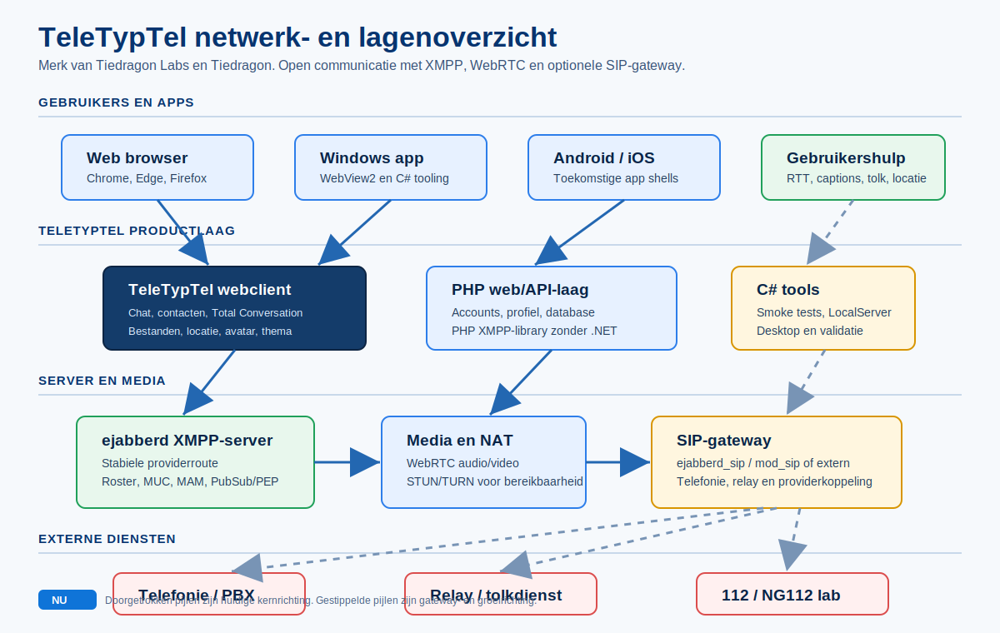

# TeleTypTel voor grote klanten

TeleTypTel is bedoeld als open communicatieplatform voor organisaties die
tekst, beeld, spraak en toegankelijkheid niet als losse producten willen
behandelen. Grote klanten kunnen denken aan telecomproviders, zorgorganisaties,
overheden, klantcontactcentra, relay-diensten, onderwijsinstellingen en
bedrijven met veel interne of externe communicatie.

Het uitgangspunt is eenvoudig: een messenger die normaal genoeg voelt voor
iedereen, maar tegelijk sterk genoeg is voor toegankelijke communicatie,
providerintegratie en toekomstige noodcommunicatiepaden.

TeleTypTel is een merk van Tiedragon Labs en Tiedragon.

## Waarde voor organisaties

- Een herkenbare chatervaring voor eindgebruikers.
- Live tekst, audio en video in dezelfde conversatie.
- Minder afhankelijkheid van een gesloten platform van een grote techpartij.
- Mogelijkheid om eigen accounts, eigen servers en eigen beleid te beheren.
- Open koppelingen richting XMPP, web, mobiele apps en later SIP-gateways.
- Betere basis voor toegankelijkheid, auditbaarheid en continuiteit.

## Voor welke klanten

TeleTypTel past bij organisaties die:

- communicatie willen aanbieden aan horende, dove en slechthorende gebruikers;
- ondersteuning willen leveren via chat, tekst, beeld en spraak;
- een eigen provider- of bedrijfsomgeving willen beheren;
- toegankelijkheid als normale productkwaliteit willen behandelen;
- niet willen dat kritieke communicatie volledig afhangt van een gesloten
  consumentendienst;
- later koppelingen willen onderzoeken met relay-diensten, telefonie,
  klantcontactsystemen of noodcommunicatie.

## Deploymentmodel

Voor grote klanten is het voorkeursmodel niet een losse lokale testserver, maar
een beheerde serveromgeving:

```text
Gebruikers
  -> web, Windows, Android, iOS
  -> TeleTypTel web/API-laag
  -> XMPP-server en media-infrastructuur
  -> optionele SIP/telefonie/relay-gateway
```



De weblaag kan draaien op PHP/Apache of PHP/Nginx. De PHP XMPP-library heeft
geen .NET 10 nodig. De C# XMPP-library blijft belangrijk voor desktoptools,
testtools, LocalServer en diepere protocolvalidatie.

## Serverrichting

Voor productie-achtige provideromgevingen is een echte XMPP-server nodig. De
lokale TeleTypTel server blijft nuttig voor tests en ontwikkeling, maar grote
klanten horen te kijken naar een geharde serveropstelling met:

- ejabberd als voorkeursserver voor stabiele provideromgevingen;
- Prosody of Openfire als nuttige tweede interoperabiliteitsdoelen;
- TLS-certificaten en goede domeinconfiguratie;
- WebSocket/BOSH of reverse proxy voor webclients;
- opslag voor accounts, roster, berichten en bestanden;
- uploadservice voor foto's, documenten en media;
- STUN/TURN voor audio/video, ontdekt via XMPP server discovery;
- logging, monitoring, back-up en abusebeleid;
- optionele ejabberd SIP-route of externe gateway naar telefonie en
  relay-diensten.

ejabberd is hier gekozen vanwege stabiliteit en schaalbaarheid. Het heeft ook
SIP-ondersteuning via `ejabberd_sip` en `mod_sip`, waardoor dezelfde
serverrichting geschikt is voor XMPP, WebSocket/BOSH, STUN/TURN-discovery,
databaseopslag en telefonieonderzoek. SIP blijft wel een gatewaylaag die apart moet worden
geconfigureerd en getest; de browserclient hoort dit niet zelf te dragen.

## Open standaarden

TeleTypTel kiest bewust voor open standaarden. Dat maakt het systeem beter
controleerbaar, beter koppelbaar en minder kwetsbaar voor een leverancier.

Belangrijke standaardfamilies:

- XMPP voor berichten, aanwezigheid, contactlijsten en uitbreidingen;
- WebRTC voor browsergebaseerde audio/video;
- SIP voor telefonie- en providerkoppelingen;
- real-time text standaarden voor live tekst tijdens gesprekken;
- Europese toegankelijkheidskaders zoals EN 301 549 en WCAG;
- privacy- en beveiligingskaders zoals AVG/GDPR en providerbeleid.

Zie [STANDAARDEN_EN_COMPLIANCE.md](STANDAARDEN_EN_COMPLIANCE.md) voor het
uitgebreide overzicht.

## Belangrijk voor verkoop en presentatie

TeleTypTel moet niet worden gepresenteerd als "alleen een hulpmiddel voor doven".
Dat maakt het product te klein en te kwetsbaar. De juiste boodschap is:

> Een normale messenger waarin toegankelijkheid standaard aanwezig is.

Dat is belangrijk voor adoptie. Horende gebruikers moeten de app ook willen
gebruiken. Pas dan ontstaat echte integratie in plaats van een aparte technische
wereld.

## Grenzen en eerlijkheid

TeleTypTel mag niet te vroeg claimen dat het gecertificeerd is voor
noodcommunicatie, wettelijke conformiteit of productiebeveiliging. Voor grote
klanten hoort er altijd een aparte validatie te komen:

- toegankelijkheidstest;
- beveiligingsreview;
- server- en netwerkontwerp;
- privacy-impactanalyse;
- interoperabiliteitstest met bestaande systemen;
- acceptatietest met echte gebruikers.

De software is de basis. Een grote klantimplementatie vraagt daarnaast beleid,
beheer, support en certificering waar dat wettelijk of contractueel nodig is.
